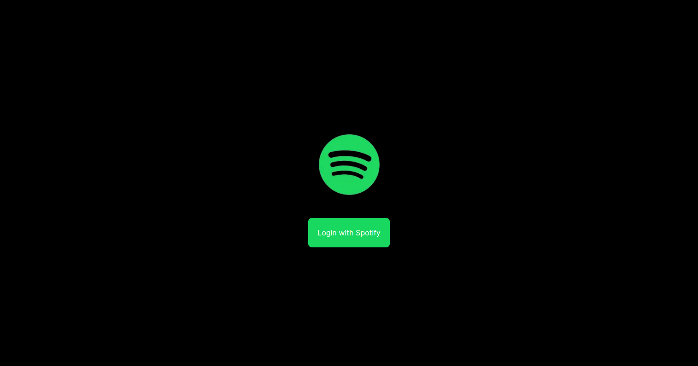
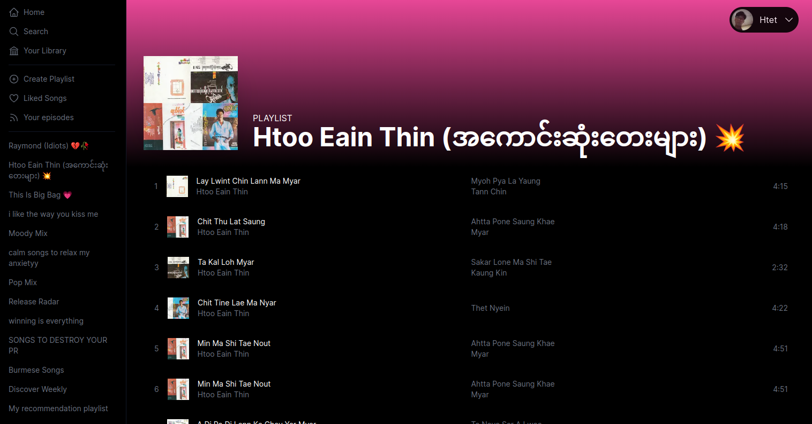

# Music Playlist App

**Music Playlist App** is an application that integrates with the Spotify API to fetch and display users' playlists. This project was developed to enhance skills in working with APIs and to provide a convenient way for users to view their Spotify playlists.

## Table of Contents

- [Installation Instructions](#installation-instructions)
- [Usage](#usage)
- [Features](#features)
- [Note](#note)
- [Contributing](#contributing)
- [License](#license)
- [Contact](#contact)

## Installation Instructions

1. **Clone the repository:**

   ```
   git clone https://github.com/HTLA380/Music-App-Using-Spotify-Api.git
   ```

2. **Navigate to the project directory:**

   ```
   cd Music-App-Using-Spotify-Api
   ```

3. **Install dependencies:**
   ```
   npm install
   ```
4. **Start the development server:**
   ```
   npm run dev
   ```

## Usage

To start using the Music Playlist App:

1.  Ensure you have a Spotify account and the Spotify application is open.
2.  Follow the installation instructions to set up the app.
3.  Navigate to the app in your browser (usually at `http://localhost:3000`).
4.  Log in with your Spotify account to access and manage your playlists.

## Features

- **User Authentication with Spotify:** Securely log in with your Spotify account.
- **Dynamic Songs Playlist:** View and interact with your Spotify playlists dynamically.

## Note

This app uses the Spotify API. To use this app, you need a Spotify account and must have the Spotify application open to ensure proper functionality.

## Preview

Login Page



Home Page


